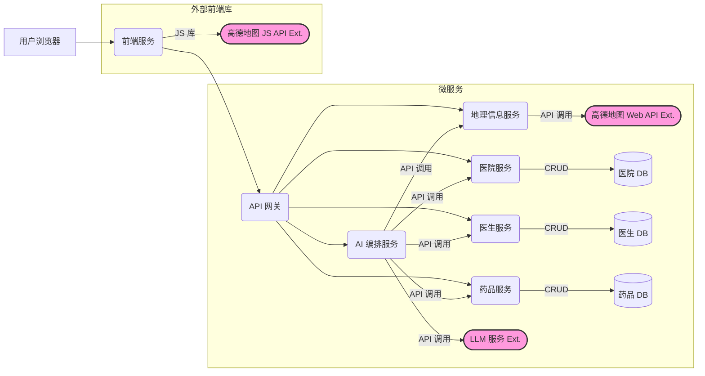

# 基于现有功能的微服务架构设想 (中文版)

## 核心思想

将当前应用拆分为一组小型的、独立的服务，每个服务围绕特定的业务能力构建，可以独立开发、部署和扩展。

## 核心服务

1.  **前端服务 (`frontend-web`)**
    *   **职责**: 处理用户界面 (UI) 和用户体验 (UX)。本质上是当前的 `gaode.html`，但可能由专门的 Web 服务器提供服务（例如 Node.js 或静态托管）。
    *   **技术**: HTML, CSS, JavaScript, (可选前端框架如 React/Vue), 高德地图 JS API。
    *   **交互**:
        *   接收用户输入（聊天消息、按钮点击）。
        *   主要与 `API 网关` 通信，发送请求和接收响应。
        *   直接使用高德地图 JS API 进行地图渲染、用户定位、路线/标记显示（根据从 `API 网关` 收到的指令）。

2.  **API 网关 (`API Gateway`)**
    *   **职责**: 作为所有客户端（前端服务）请求的单一入口点。将请求路由到合适的下游微服务。也可以处理横切关注点，如认证、速率限制、日志记录、响应聚合。
    *   **技术**: 可使用专用网关解决方案 (如 Kong, Tyk) 或简单的反向代理 (Nginx) 加逻辑。
    *   **交互**:
        *   接收来自 `前端服务` 的请求。
        *   将请求路由到 `AI 编排服务`、`地理信息服务`、`医院服务`、`医生服务`、`药品服务`。
        *   按需聚合响应。
        *   处理认证/授权。

3.  **AI 编排服务 (`ai-orchestrator`)**
    *   **职责**: 系统的"大脑"，对应当前 `main.py` 的大部分聊天逻辑。管理对话流，与 LLM 交互，并根据 LLM 的工具使用决策来编排对其他后端服务的调用。
    *   **技术**: Python (FastAPI, Flask), Node.js, Go 等。
    *   **交互**:
        *   从 `API 网关` 接收聊天请求（用户消息、历史记录、位置）。
        *   与外部 **LLM 服务** (例如通义千问 API) 通信。
        *   解析 LLM 响应，识别需要调用的"工具"。
        *   通过 API 调用（经由 `API 网关` 或内部服务发现）其他微服务 (`地理信息服务`, `医院服务`, `医生服务`, `药品服务`) 来执行这些"工具"。
        *   将工具结果发送回 LLM 服务以生成最终回复。
        *   格式化最终响应（文本 + 前端命令）并发送回 `API 网关`。
        *   管理对话历史（可短暂存储或协调专用会话服务）。

4.  **地理信息服务 (`gis-service`)**
    *   **职责**: 封装所有地理信息系统 (GIS) 相关的功能。
    *   **技术**: Python (可能需要地理空间库), Node.js, Go 等。
    *   **交互**:
        *   提供 API 端点用于：
            *   地理编码（地址转坐标，可能调用外部高德 Web 服务 API）。
            *   逆地理编码（坐标转地址）。
            *   路线规划逻辑（如果希望后端规划）。
            *   存储/检索基本城市位置数据。
        *   当需要地理操作时，由 `AI 编排服务` 调用。
        *   与外部 **高德地图 Web 服务 API** 通信。

5.  **医院服务 (`hospital-service`)**
    *   **职责**: 管理所有与医院相关的数据和业务逻辑。
    *   **技术**: Python (FastAPI, Flask), Java (Spring Boot), Node.js 等。
    *   **数据存储**: 拥有其专用的数据库 (例如 PostgreSQL, MySQL, MongoDB)，包含 `hospitals` 表/集合。
    *   **交互**:
        *   提供 API 端点用于：
            *   搜索医院 (例如 `GET /hospitals?city=...`)。
            *   根据 ID 获取医院详情 (`GET /hospitals/{id}`)。
            *   (可选的 CRUD 操作)。
        *   由 `AI 编排服务` 调用。

6.  **医生服务 (`doctor-service`)**
    *   **职责**: 管理所有与医生相关的数据和业务逻辑。
    *   **技术**: 与医院服务类似的技术选型。
    *   **数据存储**: 拥有其专用的数据库，包含 `doctors` 表/集合。可能需要引用医院 ID。
    *   **交互**:
        *   提供 API 端点用于：
            *   按科室、姓名等搜索医生 (`GET /doctors?department=...`)。
            *   根据 ID 获取医生详情 (`GET /doctors/{id}`)。
            *   (可选的 CRUD 操作)。
        *   由 `AI 编排服务` 调用。

7.  **药品服务 (`medicine-service`)**
    *   **职责**: 管理所有与药品相关的数据和业务逻辑。
    *   **技术**: 与医院服务类似的技术选型。
    *   **数据存储**: 拥有其专用的数据库，包含 `Chinese_medicine` 和 `Western_medicine` 表/集合。
    *   **交互**:
        *   提供 API 端点用于：
            *   搜索药品 (`GET /medicines?query=...&type=...`)。
            *   检查药品是否存在 (`GET /medicines/check?name=...`)。
            *   (可选的 CRUD 操作)。
        *   由 `AI 编排服务` 调用。

## 外部服务

*   **LLM 服务**: 实际的大语言模型提供商（如 OpenAI, Google Gemini, 阿里云通义千问）。通过 API 访问。
*   **高德地图服务 (JS API & Web 服务 API)**: 外部 GIS 提供商。通过前端 JS 库和后端 HTTP API 调用访问。

## 通信方式

*   服务之间通常通过同步的 RESTful API (HTTP) 或 gRPC 进行通信。
*   对于某些操作（如通知多个服务更新），可以考虑使用消息代理（如 RabbitMQ 或 Kafka）进行异步通信，但初期可能过度设计。

## 架构草图



## 与单体架构的主要区别

*   **分解**: 后端逻辑被拆分为独立的服务。
*   **独立数据存储**: 每个核心数据服务（医院、医生、药品）管理自己的数据库。
*   **网络通信**: 服务通过网络 API 进行通信。
*   **编排**: 专门的服务 (`AI 编排服务`) 处理涉及 LLM 和协调其他服务的复杂流程。
*   **API 网关**: 集中了入口点和通用关注点。

这种微服务方法提供了更好的可伸缩性、灵活性和弹性，但与当前的单体架构相比，在部署、监控和管理分布式系统方面引入了复杂性。

---

# 当前项目逻辑与功能实现分析

## 一、 核心处理流程概述

整个系统的交互可以概括为以下流程：

```mermaid
graph TD
    A[用户在前端界面输入自然语言] --> B(前端JS发送请求到 /api/chat);
    B --> C{后端 main.py 接收请求};
    C --> D[注入系统提示 (System Prompt) 和用户位置上下文];
    D --> E[调用 LLM (第一次)];
    E -- LLM判断需要工具 --> F{后端执行对应的工具函数};
    F --> G[工具函数可能调用 database_utils 或 外部API (如高德地理编码)];
    G --> H[后端收集工具执行结果];
    H --> I[调用 LLM (第二次) 并传入工具结果];
    E -- LLM判断无需工具 --> J[LLM直接生成回复];
    I --> J;
    J --> K[后端格式化最终响应 (包含文本回复和给前端的指令)];
    K --> L(前端JS接收响应);
    L -- 显示文本回复 --> M[用户查看聊天消息];
    L -- 包含地图指令? --> N[前端JS调用高德地图JS API执行操作];
    N --> O[地图界面更新 (定位/标记/路线)];
```

## 二、 系统提示词 (System Prompt) 逻辑分析

你在 `main.py` 中定义了一个非常详细的系统提示，它扮演着**AI助手的核心行为准则和操作手册**。关键逻辑点包括：

1.  **角色与能力定义**: 明确AI是"医疗问诊助手"，具备意图识别、关键词提取、工具调度、基础医疗知识、Markdown输出等能力。
2.  **核心规则 - 智能分析优先**:
    *   **强制先分析后行动**: 收到用户输入后，*必须*先识别意图和提取关键词。
    *   **决策分支**: 根据分析结果决定是纯聊天、调用查询工具 (`find_doctors`, `search_hospitals` 等)、执行任务（如导航），还是请求澄清。
    *   **多工具调用**: 允许一次调用多个工具处理复杂请求。
3.  **严格的导航流程**:
    *   **特定流程优先**: 导航流程规则优先级高于通用规则。
    *   **禁止无确认导航**: 严禁在未确认用户位置时调用路线规划工具。
    *   **分步确认**: 导航被拆分为明确的步骤（医生选择->导航确认->路线规划执行），尤其是"导航确认"步骤**绝对禁止调用任何工具**，只能生成特定模板的文本回复，强制用户确认起点。
    *   **起点确定逻辑**: 在"路线规划执行"步骤，明确规定了获取起点的优先级（用户新地址 > 上下文地址）。
4.  **工具使用约束**:
    *   `find_doctors`: 禁止直接使用模糊症状，需先分析。
    *   所有工具的JSON结果不能直接展示给用户，需要转译成自然语言。
5.  **输出格式要求**:
    *   多项信息、步骤使用Markdown列表。
    *   重点信息（位置、医生、药品等）使用Markdown加粗。
    *   医保信息输出有特定格式和引用来源要求。
6.  **医疗场景特殊规则**:
    *   医生推荐需结合教育背景和简介。
    *   路线规划成功后（若是医疗场景）需加健康关怀语。
    *   推荐用户打车就医并提醒陪同。

**总结**: 这个系统提示非常强大且精细，它不仅仅是简单的角色扮演，而是**深度嵌入了业务逻辑和流程控制**。LLM需要严格遵守这些规则，特别是导航流程中的状态判断和条件约束。

## 三、 工具设定与功能实现逻辑 (结合流程图)

以下是每个主要工具/功能的实现逻辑：

1.  **获取城市位置 (`get_city_location`)**
    *   **目的**: 根据用户提供的城市名称，获取其经纬度并在地图上定位。
    *   **流程**:
        ```mermaid
        graph TD
            A[用户: "深圳在哪里?"] --> B{LLM: 识别意图};
            B --> C[LLM: 调用 get_city_location(city_name='深圳')];
            C --> D{后端: main.py -> get_city_location};
            D --> E[后端: 调用 _get_coords];
            E -- 查内置CITY_LOCATIONS --> F{找到?};
            F -- 是 --> G[返回坐标];
            F -- 否 --> H[调用高德地理编码API];
            H --> G;
            G --> I[后端: 格式化JSON (含 lat/lon, command='locate_city')];
            I --> J{LLM: 生成回复 "已找到深圳位置"};
            J --> K{前端: 接收回复 + Tool Result};
            K --> L[前端JS: 执行 handleToolResults -> locateCity()];
            L --> M[地图: 定位到深圳并添加标记];
        ```

2.  **搜索医院 (`search_hospitals`)**
    *   **目的**: 根据城市名称（模糊匹配地址）查找数据库中的医院并在地图上标记。
    *   **流程**:
        ```mermaid
        graph TD
            A[用户: "广州有哪些三甲医院?"] --> B{LLM: 识别意图 (提取'广州'和'医院')};
            B --> C[LLM: 调用 search_hospitals(city_name='广州')];
            C --> D{后端: main.py -> search_hospitals};
            D --> E[后端: 调用 database_utils.query_hospitals_by_city];
            E --> F[数据库: 执行 SQL (SELECT * FROM hospitals WHERE address LIKE '%广州%')];
            F --> G[后端: 格式化JSON (含医院列表, command='show_hospitals')];
            G --> H{LLM: 生成回复 "为您找到广州的N家医院信息"};
            H --> I{前端: 接收回复 + Tool Result};
            I --> J[前端JS: 执行 handleToolResults -> showHospitals()];
            J --> K[地图: 清除旧标记, 定位到城市附近, 添加所有医院标记];
        ```

3.  **获取当前时间 (`get_current_time`)**
    *   **目的**: 返回当前的系统时间。
    *   **流程**:
        ```mermaid
        graph TD
            A[用户: "现在几点了?"] --> B{LLM: 识别意图};
            B --> C[LLM: 调用 get_current_time()];
            C --> D{后端: main.py -> get_current_time};
            D --> E[后端: 获取系统时间并格式化];
            E --> F[后端: 返回 JSON (含 current_time)];
            F --> G{LLM: 生成回复 "当前时间是 X年X月X日 X时X分X秒"};
            G --> H[前端: 显示回复文本];
        ```

4.  **触发前端路线规划 (`trigger_frontend_route_planning`)**
    *   **目的**: (由LLM在严格的导航流程后调用) 指示前端使用高德地图JS API进行路线规划。
    *   **流程 (关键部分)**:
        ```mermaid
        graph TD
            subgraph "导航确认步骤 (LLM处理, 无工具调用)"
                A[...]
            end
            subgraph "路线规划执行步骤"
                B[用户: 确认导航起点] --> C{LLM: 识别用户确认};
                C -- 遵循导航流程 Step 4 --> D;
                D -- 确定起点/终点 --> E[LLM: **必须**调用 trigger_frontend_route_planning(origin='起点', destination='终点医院')];
                E --> F{后端: main.py -> trigger_frontend_route_planning};
                F --> G[后端: 简单格式化参数];
                G --> H[后端: 返回JSON (command='plan_route_on_frontend', origin, destination)];
                H --> I{LLM: **必须**生成文本回复 (如: '好的,已规划...')};
                I --> J{前端: 接收文本回复 + Tool Result};
                J --> K[前端JS: 执行 handleToolResults (找到 plan_route_on_frontend 指令)];
                K --> L[前端JS: 调用 高德地图JS API Driving.search(起点, 终点)];
                L --> M[地图: 显示驾车路线];
            end
        ```

5.  **查找医生 (`find_doctors`)**
    *   **目的**: 根据用户提供的科室名称（或其他关键词，但目前已修改为仅科室）在数据库中查找医生基本信息。
    *   **流程**:
        ```mermaid
        graph TD
            A[用户: "帮我找找心内科的医生"] --> B{LLM: 识别意图 (提取'心内科')};
             B -- 检查是否需要症状分析 (根据Prompt规则) --> C
            C --> D[LLM: 调用 find_doctors(query='心内科')];
            D --> E{后端: main.py -> find_doctors_tool};
            E --> F[后端: 调用 database_utils.query_doctors_by_specialty_or_expertise];
            F --> G[数据库: 执行 SQL (SELECT id,name,dept,title,hospital_name FROM doctors JOIN hospitals WHERE department LIKE '%心内科%')];
            G --> H[后端: 格式化JSON (含 doctors_list, count)];
            H --> I{LLM: 基于列表生成回复 (如: '为您找到以下心内科医生:...')};
            I --> J[前端: 显示回复文本];
        ```

6.  **获取医生详情 (`get_doctor_details`)**
    *   **目的**: 根据用户指定的医生ID，查询该医生的详细信息（包括教育背景、专长、简介、所属医院等）。
    *   **流程**:
        ```mermaid
        graph TD
            A[用户: "了解一下刚才列表里ID为 45 的医生"] --> B{LLM: 识别意图 (提取 doctor_id=45)};
            B --> C[LLM: 调用 get_doctor_details(doctor_id=45)];
            C --> D{后端: main.py -> get_doctor_details_tool};
            D --> E[后端: 调用 database_utils.get_doctor_details];
            E --> F[数据库: 执行 SQL (SELECT ... FROM doctors JOIN hospitals WHERE d.id=45)];
            F --> G[后端: 格式化JSON (含 doctor_details)];
            G --> H{LLM: 基于详情生成回复 (根据Prompt规则强调教育/简介)};
            H --> I[前端: 显示回复文本];
            I --> J{LLM: (可能根据Prompt规则) 询问是否需要导航};
        ```

7.  **查询药品信息 (`find_medicine_info`)**
    *   **目的**: 根据药品名称或关键词查询药品信息（可指定中/西药）。
    *   **流程**:
        ```mermaid
        graph TD
            A[用户: "感冒灵颗粒是中药还是西药?"] --> B{LLM: 识别意图 (提取'感冒灵颗粒')};
            B --> C[LLM: 调用 find_medicine_info(query='感冒灵颗粒', medicine_type='all')];
            C --> D{后端: main.py -> find_medicine_info_tool};
            D --> E[后端: 调用 database_utils.query_medicines];
            E --> F[数据库: 执行 SQL (SELECT ... FROM Chinese_medicine UNION ALL SELECT ... FROM Western_medicine WHERE drug_name LIKE '%感冒灵颗粒%')];
            F --> G[后端: 格式化JSON (含 medicines_found)];
            G --> H{LLM: 基于结果生成回复 (如: '查询到感冒灵颗粒是[类型]药...')};
            H --> I[前端: 显示回复文本];
        ```

8.  **检查药品是否存在/医保 (`check_medicine_listing`)**
    *   **目的**: （模糊）查询指定药品是否存在于数据库中，LLM可根据此信息结合规则判断医保情况。
    *   **流程**:
        ```mermaid
        graph TD
            A[用户: "看看布洛芬在不在列表里"] --> B{LLM: 识别意图 (提取'布洛芬')};
            B --> C[LLM: 调用 check_medicine_listing(medicine_name='布洛芬')];
            C --> D{后端: main.py -> check_medicine_listing_tool};
            D --> E[后端: 调用 database_utils.check_medicine_existence];
            E --> F[数据库: 执行 SQL (SELECT ... FROM Chinese_medicine UNION ALL ... WHERE drug_name LIKE '%布洛芬%' LIMIT 1)];
            F --> G[后端: 格式化JSON (含 medicine_found, medicine_details?)];
            G --> H{LLM: 基于结果生成回复 (可能结合Prompt规则添加医保说明链接)};
            H --> I[前端: 显示回复文本];
        ```

## 总结与建议

*   你当前的系统提示词非常详细，是整个应用智能化的核心。
*   工具的设定与数据库/外部API的交互逻辑清晰。
*   最复杂的部分在于**导航流程**，LLM需要严格遵循提示词中定义的、带有状态和条件判断的多步骤规则。
*   当你重构项目时（无论是优化现有单体还是转向微服务），务必保证LLM的提示词（或者将来可能实现的更结构化的流程引擎）能够准确地驱动这些工具和流程。
*   对于微服务架构，`AI Orchestrator` 服务将承担当前 `main.py` 中大部分与LLM交互和工具调用决策的职责，而其他服务则专注于提供单一的业务能力API。

希望这些结合流程图的分析对你理解现有系统和规划重构有帮助！

## 四、LLM 配置与交互

根据 `main.py` 文件中的代码，当前项目与大语言模型 (LLM) 的交互配置如下：

*   **客户端类型**: 使用与 OpenAI API 兼容的 Python 客户端 (`openai` 库)。
*   **API 密钥来源**: API 密钥通过读取名为 `DASHSCOPE_API_KEY` 的环境变量来获取。
*   **API 基地址 (Base URL)**: 设置为 `https://dashscope.aliyuncs.com/compatible-mode/v1`。这表明实际调用的是阿里云的通义千问 Dashscope 服务，该服务提供了兼容 OpenAI 的接口模式。
*   **模型名称**: 在每次调用 `client.chat.completions.create` 时，明确指定使用的模型为 `qwen-plus`。
*   **交互模式**: 采用的是一种支持工具调用的多轮交互模式：
    1.  **第一次调用**: 将包含系统提示、用户位置（如果可用）、对话历史和最新用户消息的内容发送给 LLM。LLM 根据这些信息和定义的 `tools` 参数，判断是否需要调用一个或多个工具，并在响应中返回 `tool_calls` 指令。
    2.  **工具执行**: 如果收到 `tool_calls`，后端会解析指令，执行相应的本地工具函数（如数据库查询）。
    3.  **第二次调用 (如果需要)**: 将第一次的 LLM 响应 (包含 `tool_calls`) 和所有工具执行的结果 (`role='tool'`) 追加到消息历史中，再次调用 LLM。LLM 会利用工具返回的信息来生成最终面向用户的自然语言回复。
    4.  **无工具调用**: 如果第一次调用 LLM 后没有返回 `tool_calls`，则直接将该次 LLM 的回复作为最终结果。 